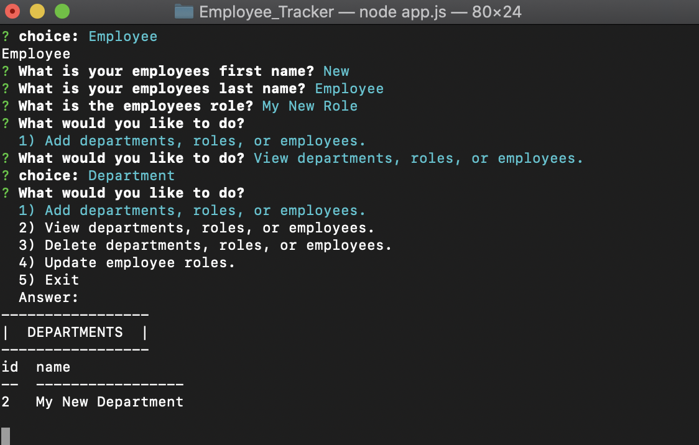

# Employee_Tracker

[](https://opensource.org/licenses/MIT)

## Description

A cli application that allows a manager to add view and delete a companys current employees roles and departments. [View Video Here.](https://youtu.be/GyUaVSLKEJk)

## Table of Contents

- [Employee_Tracker](#employee_tracker)
  - [Description](#description)
  - [Table of Contents](#table-of-contents)
  - [User Story](#user-story)
  - [Usage](#usage)
  - [Built With](#built-with)
  - [License](#license)
  - [Contributing](#contributing)
  - [Testing](#testing)
  - [Contact](#contact)

## User Story

```
As a business owner

I want to be able to view and manage the departments, roles, and employees in my company

So that I can organize and plan my business
```

## Usage

View the deployed heroku application [here](https://warm-bayou-36809.herokuapp.com/).




## Built With

- node.js
- console.table
- uuid

## License

[MIT](LICENSE)

## Contributing

To contribute to this project create a branch with the feature or correction then submit a pull request.

## Testing

No tests have been created for this application at this time.

## Contact

Please direct any questions or concerns directly to me via my email address listed below.

- Github: [relizabet](https://github.com/relizabet)
- Email: rachel@relizabeth.com
